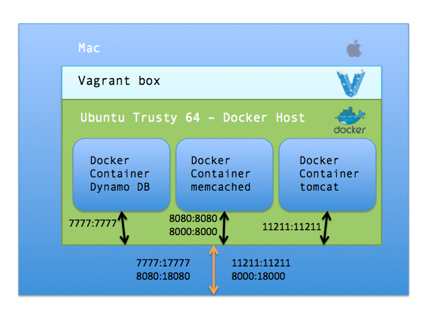

This project contains my dev-in-a-box environment which has now been completely dockerized. I'll add more containers to this project when I get time. 

Currently I've dockerized 3 containers - 
* AWS DynamoDB local
* memcached
* Tomcat 7.0.57 with debug mode enabled

To run these containers on a Mac you will need a virtual docker host which will be created automatically by reading the docker host file - DockerHostVagrantfile. This will spin Ubuntu Trust 64 base box with docker-lxc installed on it, and will act as a docker host for running any container.

To get started simply execute - 
`vagrant up`
