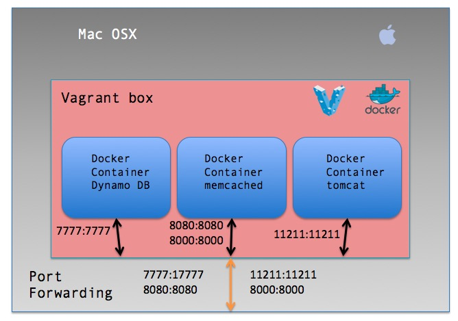

Docker dev-in-the-box

====================================================
On boarding of new engineers to the team is often the most laborious job. Providing them right set of tools to start with can go a long way into creating good impression of the team on the new engineer. This project was initiated with that view. Currently the dev-in-box brings up memcached, DynamoDb and tomcat all in a single vagrant box with port forwarding setup to host machine.

Currently I've dockerized 3 containers - 
* AWS DynamoDB local
* memcached
* Tomcat 8.0.30 with debug mode enabled



These containers are using docker-compose vagrant plugin to run as lxc-docker containers. Use the following command to install the vagrant docker-compose plugin

```bash vagrant plugin install vagrant-docker-compose```

To get started simply execute - 
```bash vagrant up```

To inspect docker containers - 
```bash
vagrant ssh
docker ps
```
